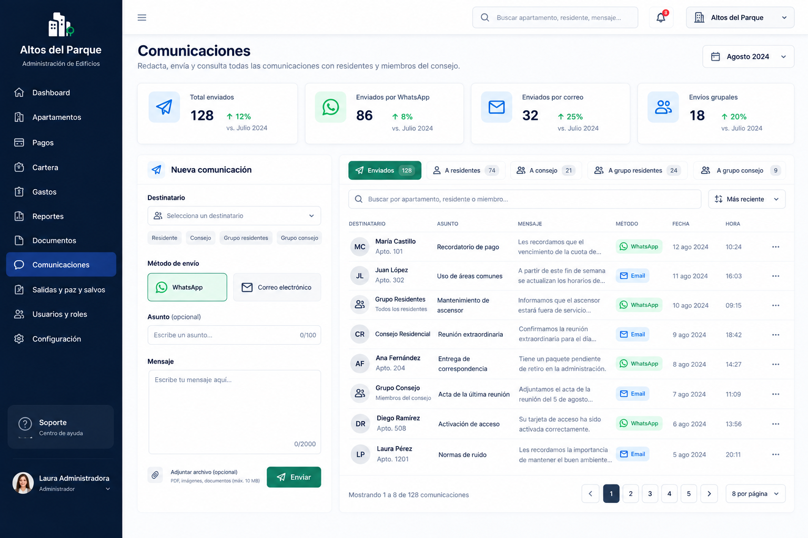
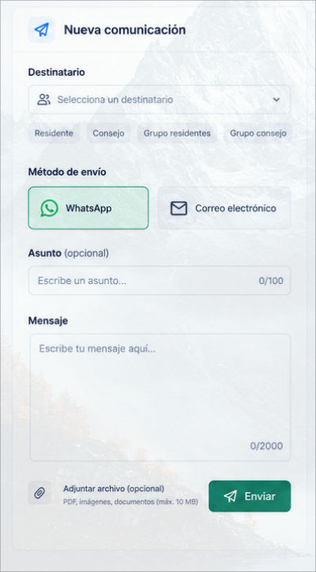

# Strategic Reports Breakdown

# 1. Objective

This directory contains the reference visual prototype for the **main Reports management interface**.

These images represent an approximation of how the system should look after development and will serve as a guide for tasks created within **GitHub Projects**.

The goal of this documentation is to enable any developer to understand:

* What each section of the interface represents.
* Which components need to be developed.
* Which elements should be omitted.
* Which information will be dynamic.
* The expected behavior of each component.
* Developer responsibilities.
* Responsibilities to be handled later during integration.

> [!IMPORTANT]
> The images are visual references and do not necessarily represent the system's final behavior.
>
> The written instructions in this document take precedence over any elements shown in the prototypes.

---

# 2. Complete Prototype

This component is important for managing communications within the building.

---

## 3. Component Principles

Components should be built with a primary focus on:

### Reusability

A component should not be designed exclusively for a single value when it can represent different data via parameters.

### Independence

A visual component should not need to know how the information it displays is obtained.

### Configuration via Props

Whenever possible, reusable components should receive the information needed for rendering via `props`.

### Separation of Concerns

The component's primary responsibility will be to **render information and visual behavior**.

Data fetching, transformation, and integration will be handled in higher-level layers where appropriate.

---

# 4. New Communications Component

The most common forms of global communication are email and WhatsApp; this component centralizes communications by connecting directly to the necessary chats and contacts.

Please note the following:

The `Destinatario` field must display a list of users sourced from test data (a .json or .js file, if deemed necessary).

The tags located immediately below this component must not be rendered; they will not be part of the flow.

Clicking `Adjuntar archivo (opcional)`—which will be a button—must trigger a function that displays an alert saying: "Abriendo explorador de archivos...".

# 5. Additional restrictions:

- The `Enviar` button in the new communications component needs to be blue, just like the button for `Registrar apartamento` in the apartments interface.

- In the table component, the filter section should be omitted, as it will not be part of the interface:
[Table component](./table_component.jpg)
- Remember to properly implement column rendering using the `render` function, based on the column's value (Email, WhatsApp).
- Remember that test data found in each component/module is used to develop the table.

- In the card component, neither the percentage nor the date should be rendered:
[Cards component](./cards_component.jpg)
-Remember that test data found in each component/module is used to develop the cards.
